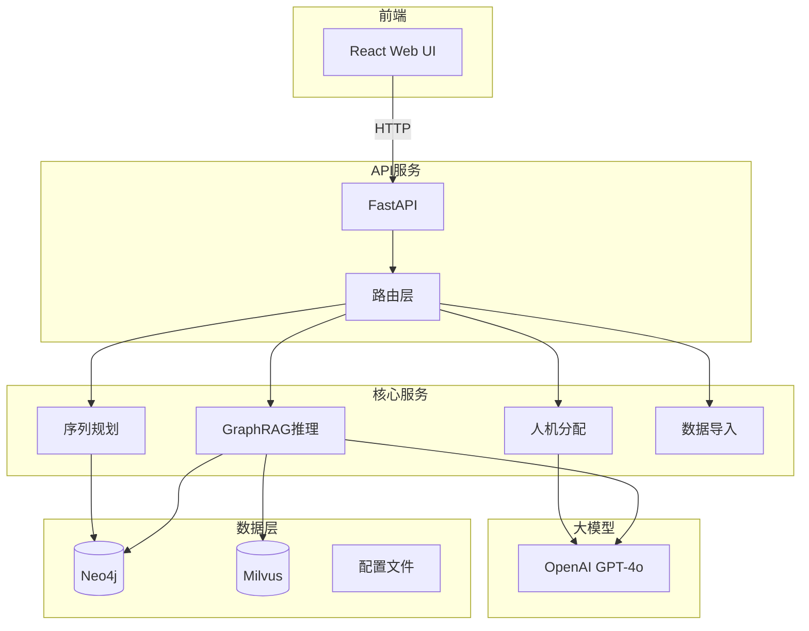
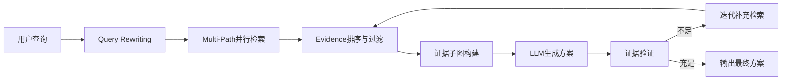
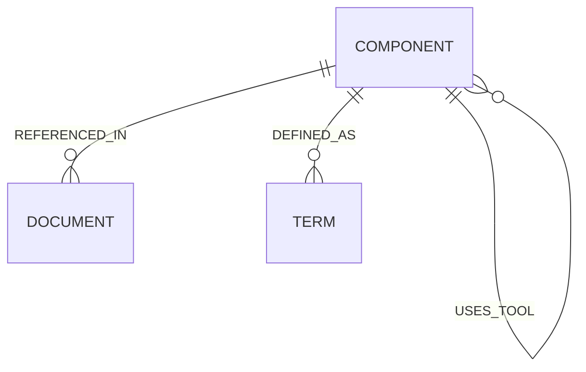

# 动力电池拆卸知识图谱与GraphRAG推理系统

<div align="center">

[](https://www.python.org/)
[](https://fastapi.tiangolo.com/)
[](https://neo4j.com/)
[](https://react.dev/)
[](https://www.typescriptlang.org/)

**基于知识图谱的智能拆卸规划推理系统，支持自然语言查询返回结构化拆卸方案**

[English](./README_EN.md) | 中文

</div>

---

## 目录

- [项目简介](#项目简介)
- [核心能力](#核心能力)
- [技术架构](#技术架构)
- [快速开始](#快速开始)
- [项目结构](#项目结构)
- [API文档](#api文档)
- [前端界面](#前端界面)
- [开发指南](#开发指南)
- [测试](#测试)
- [部署](#部署)
- [贡献指南](#贡献指南)
- [许可证](#许可证)

---

## 项目简介

本项目旨在构建一个基于知识图谱的智能拆卸规划推理系统，专门针对动力电池拆卸场景。系统整合了：

- **知识图谱存储** (Neo4j) + **向量检索** (Milvus)
- **增强型GraphRAG** (Query Rewriting + Multi-Path检索 + 证据排序 + 迭代补充)
- **拆卸序列规划** (Tarjan环路检测 + 拓扑排序 + MTM时间估算)
- **人机协作分配** (LLM实时9因素打分 + AS自动化得分)
- **可视化前端界面** (React + TypeScript)

### 适用场景

- 动力电池拆卸工艺规划
- 电池回收处理流程优化
- 维修人员培训与指导
- 质量控制与工艺改进

---

## 核心能力

### Phase 1: 核心知识图谱 + GraphRAG

| 能力 | 描述 |
|------|------|
| 自然语言查询 | 支持自然语言输入电池型号和上下文 |
| 多路径检索 | Component/Document/Term 三路径并行检索 |
| 查询重写 | 自动扩展检索意图，提升召回率 |
| 证据排序 | 基于文本相似度、图中心性、新鲜度的多维排序 |
| 迭代补充 | 自动检测缺失证据并补充 |
| 调试模式 | 完整推理轨迹可视化 |

### Phase 2: 拆卸序列 + 人机协作

| 能力 | 描述 |
|------|------|
| 环路检测 | Tarjan算法检测依赖环并智能拆分 |
| 序列规划 | 拓扑排序生成有效拆卸序列 |
| 时间估算 | MTM方法计算每步操作时间 |
| 人机分配 | 基于AS得分的human/robot自动分配 |
| 混合图输出 | Mermaid + JSON双格式输出 |

### Phase 3: 可视化界面

| 能力 | 描述 |
|------|------|
| 图谱浏览 | 交互式知识图谱可视化 |
| 推理查询 | 文本查询 + 模板 + 上下文 + Debug |
| 序列可视化 | 流程图 + 时间线视图 |
| 文件导入 | L1/L2/L3多格式导入支持 |
| 参数配置 | 9类参数动态调整 |

---

## 技术架构

### 系统架构图



### GraphRAG 推理流程



### 三层知识图谱



| 层级 | 类型 | 说明 |
|------|------|------|
| L1 | Component | 拆卸部件/步骤（用户指定） |
| L2 | Document | 参考文档（PDF导入） |
| L3 | Term | 术语定义（自动提取） |

---

## 快速开始

### 环境要求

- Python 3.11+
- Node.js 18+
- Neo4j 5.20+
- Milvus 2.4+ (可选)
- Docker & Docker Compose (推荐)

### 1. 克隆项目

```bash
git clone https://github.com/01Rit/EVB_KG_LLM.git
cd EVB_KG_LLM
```

### 2. 配置环境变量

```bash
cp .env.example .env
# 编辑 .env 填入你的配置
```

**.env.example 内容：**
```env
NEO4J_URI=bolt://localhost:7687
NEO4J_USER=neo4j
NEO4J_PASSWORD=your_password_here
MILVUS_HOST=localhost
MILVUS_PORT=19530
OPENAI_API_KEY=sk-your-api-key-here
OPENAI_BASE_URL=https://api.openai.com/v1
MODEL=gpt-4o
TEMPERATURE=0.1
MAX_TOKENS=2000
```

### 3. 使用Docker启动

```bash
docker-compose up -d
```

### 4. 手动启动（开发模式）

**后端：**
```bash
# 创建虚拟环境
python -m venv venv
source venv/bin/activate  # Linux/Mac
# or: venv\Scripts\activate  # Windows

# 安装依赖
pip install -r requirements.txt

# 启动服务
uvicorn src.main:app --reload --port 8000
```

**前端：**
```bash
cd frontend
npm install
npm run dev
```

### 5. 访问界面

- 前端界面: http://localhost:3000
- API文档: http://localhost:8000/docs
- Neo4j Browser: http://localhost:7474

---

## 项目结构

```
EVB_KG_LLM/
├── src/                          # Python后端源码
│   ├── main.py                   # FastAPI应用入口
│   ├── config.py                 # 配置管理
│   ├── logs.py                   # 日志配置
│   │
│   ├── kg/                       # 知识图谱模块
│   │   └── client.py             # Neo4j/Milvus客户端
│   │
│   ├── graphrag/                 # GraphRAG核心模块
│   │   ├── query_rewriter.py     # 查询重写
│   │   ├── retriever.py          # 多路径检索
│   │   ├── ranker.py             # 证据排序
│   │   ├── generator.py           # LLM生成
│   │   ├── query_rewriter.py     # 查询重写
│   │   └── planner.py             # 整体编排
│   │
│   ├── sequence/                  # 拆卸序列模块
│   │   ├── planner.py             # 序列规划主逻辑
│   │   ├── cycle_detector.py      # Tarjan环路检测
│   │   ├── topological_sort.py    # 拓扑排序
│   │   └── time_estimator.py      # MTM时间估算
│   │
│   ├── allocator/                 # 人机协作模块
│   │   ├── scorer.py              # LLM 9因素打分
│   │   ├── as_calculator.py        # AS得分计算
│   │   └── allocator.py           # 分配主逻辑
│   │
│   ├── graph_output/             # 混合图输出模块
│   │   ├── mermaid_gen.py         # Mermaid生成
│   │   ├── json_builder.py        # JSON构建
│   │   └── generator.py           # 输出主逻辑
│   │
│   ├── importer/                 # 数据导入模块
│   │   ├── pdf_parser.py          # PyMuPDF解析
│   │   ├── path_classifier.py     # 路径分类
│   │   ├── entity_extractor.py     # LLM提取L2/L3
│   │   └── importer.py            # 导入主逻辑
│   │
│   ├── api/                      # API路由
│   │   ├── routes.py             # 核心路由
│   │   ├── graph_routes.py        # 图谱路由
│   │   ├── query_routes.py       # 查询路由
│   │   ├── import_routes.py       # 导入路由
│   │   ├── admin_routes.py        # 管理路由
│   │   └── schemas.py             # 请求/响应模型
│   │
│   └── utils/                    # 工具模块
│       └── llm_client.py         # LLM调用封装
│
├── frontend/                     # React前端源码
│   ├── public/                   # 静态资源
│   ├── src/
│   │   ├── main.tsx             # 入口文件
│   │   ├── App.tsx              # 根组件
│   │   ├── api/                 # API客户端
│   │   │   └── client.ts
│   │   ├── components/          # 公共组件
│   │   │   ├── Layout/
│   │   │   ├── GraphView/
│   │   │   ├── SequenceView/
│   │   │   ├── FileImporter/
│   │   │   ├── ParamEditor/
│   │   │   └── QueryPanel/
│   │   ├── pages/               # 页面组件
│   │   │   ├── Dashboard.tsx
│   │   │   ├── GraphExplorer.tsx
│   │   │   ├── Query推理.tsx
│   │   │   ├── SequencePlanner.tsx
│   │   │   ├── ImportManager.tsx
│   │   │   └── Settings.tsx
│   │   ├── hooks/               # 自定义Hooks
│   │   ├── types/               # TypeScript类型
│   │   └── utils/
│   ├── package.json
│   ├── tsconfig.json
│   ├── vite.config.ts
│   └── Dockerfile
│
├── tests/                       # 测试代码
│   ├── kg/
│   ├── graphrag/
│   ├── sequence/
│   ├── allocator/
│   ├── importer/
│   ├── graph_output/
│   └── api/
│
├── docs/                        # 文档
│   └── superpowers/
│       ├── specs/               # 设计文档
│       └── plans/               # 实现计划
│
├── docker-compose.yml           # Docker编排
├── Dockerfile                   # 后端Dockerfile
├── pytest.ini                   # Pytest配置
├── requirements.txt             # Python依赖
└── README.md                    # 本文件
```

---

## API文档

### 核心接口

#### POST /api/v1/disassembly/plan

拆卸规划推理

**请求：**
```json
{
  "battery_model": "X123",
  "context": ["室温环境", "低湿度"],
  "debug": false
}
```

**响应：**
```json
{
  "code": 0,
  "message": "Success",
  "data": {
    "steps": [
      {
        "id": 1,
        "component": "BatteryCover",
        "action": "remove_screws",
        "tool": ["screwdriver_px4"],
        "evidence": ["manual_section_2.1", "GB_T_12345"],
        "confidence": 0.95,
        "safety_level": 2
      }
    ],
    "total_time_estimate": 30
  }
}
```

#### GET /api/v1/health

健康检查

**响应：**
```json
{
  "status": "healthy",
  "neo4j": "connected",
  "milvus": "connected",
  "llm": "available"
}
```

### 图谱接口

| 方法 | 路径 | 功能 |
|------|------|------|
| GET | /graph/nodes | 获取所有节点 |
| GET | /graph/node/{node_id} | 获取节点详情 |
| GET | /graph/relationships | 获取关系 |
| GET | /graph/search?q={query} | 搜索节点 |

### 导入接口

| 方法 | 路径 | 功能 |
|------|------|------|
| POST | /import/l1/manual | L1手动导入 |
| POST | /import/l1/csv | L1 CSV导入 |
| POST | /import/l1/txt | L1 TXT导入 |
| POST | /import/l1/pdf | L1 PDF提取 |
| POST | /import/l2 | L2 PDF导入 |
| POST | /import/l3 | L3导入 |
| GET | /import/status | 导入状态 |

### 管理接口

| 方法 | 路径 | 功能 |
|------|------|------|
| GET | /admin/documents | 列出所有文档 |
| POST | /admin/components/promote | 将L2升级为L1 |
| GET | /admin/components | 列出所有L1组件 |

详细API文档请访问 http://localhost:8000/docs

---

## 前端界面

### 页面概览

| 页面 | 路径 | 功能 |
|------|------|------|
| 仪表盘 | `/` | 概览统计 + 最近推理记录 |
| 图谱浏览 | `/graph` | 知识图谱交互可视化 |
| 推理查询 | `/query` | 自然语言查询拆卸方案 |
| 序列规划 | `/sequence` | 拆卸序列流程图 |
| 导入管理 | `/import` | L1/L2/L3文件导入 |
| 参数设置 | `/settings` | 系统参数配置 |

### 截图预览

> 截图待添加

---

## 开发指南

### 添加新的检索路径

1. 在 `src/graphrag/retriever.py` 中添加检索方法
2. 在 `MultiPathRetriever` 中集成新路径
3. 添加对应的测试用例

### 添加新的拆卸步骤类型

1. 在 `src/sequence/planner.py` 中定义新类型
2. 更新 `DisassemblySequence` 模型
3. 更新 `GraphOutputGenerator` 支持新类型

### 添加新的导入格式

1. 在 `src/importer/` 中创建解析器
2. 在 `src/api/import_routes.py` 中添加路由
3. 更新前端导入组件

---

## 测试

### 运行所有测试

```bash
# Python测试
python -m pytest tests/ -v

# 或使用脚本
python run_pytest.py
```

### 运行特定模块测试

```bash
# 仅GraphRAG测试
python -m pytest tests/graphrag/ -v

# 仅序列规划测试
python -m pytest tests/sequence/ -v
```

### 测试覆盖率

```bash
python -m pytest tests/ --cov=src --cov-report=html
```

---

## 部署

### Docker部署（推荐）

```bash
# 构建并启动所有服务
docker-compose up -d

# 查看日志
docker-compose logs -f

# 停止服务
docker-compose down
```

### 生产环境部署

1. 配置反向代理 (Nginx)
2. 启用HTTPS
3. 配置监控和日志
4. 设置备份策略

### 环境变量说明

| 变量 | 必填 | 说明 |
|------|------|------|
| NEO4J_URI | 是 | Neo4j连接URI |
| NEO4J_USER | 是 | Neo4j用户名 |
| NEO4J_PASSWORD | 是 | Neo4j密码 |
| OPENAI_API_KEY | 是 | OpenAI API密钥 |
| MILVUS_HOST | 否 | Milvus主机 |
| MILVUS_PORT | 否 | Milvus端口 |

---

## 贡献指南

1. Fork 本仓库
2. 创建特性分支 (`git checkout -b feature/AmazingFeature`)
3. 提交更改 (`git commit -m 'Add some AmazingFeature'`)
4. 推送到分支 (`git push origin feature/AmazingFeature`)
5. 创建 Pull Request

### 开发规范

- Python代码遵循 PEP 8
- 使用Pydantic进行数据验证
- 前端代码遵循项目TypeScript规范
- 所有新功能需要包含测试
- 确保所有测试通过后再提交PR

---

## 许可证

本项目采用 MIT 许可证 - 详见 [LICENSE](LICENSE) 文件

---

## 致谢

- [Neo4j](https://neo4j.com/) - 图数据库
- [Milvus](https://milvus.io/) - 向量数据库
- [FastAPI](https://fastapi.tiangolo.com/) - Web框架
- [React](https://react.dev/) - UI框架
- [OpenAI](https://openai.com/) - 大语言模型

---

<div align="center">

**如果这个项目对你有帮助，请给它一个 star ⭐**

</div>
