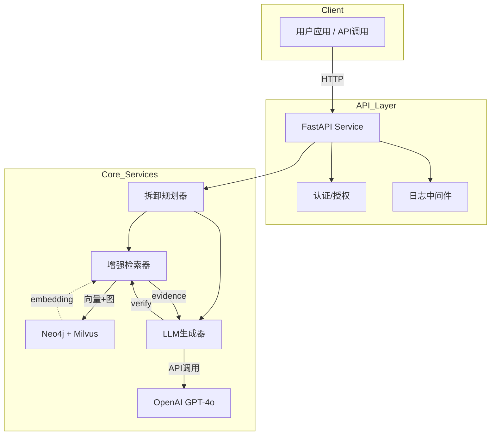
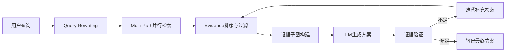
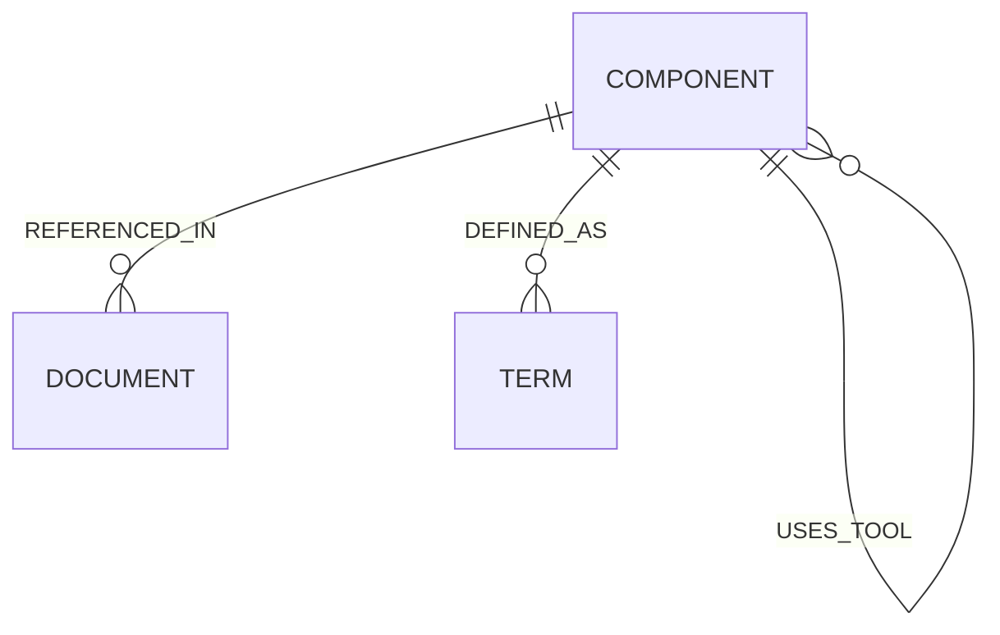

# 阶段1：核心知识图谱 + GraphRAG推理模块 设计文档

> **项目**：动力电池拆卸知识图谱与GraphRAG推理系统  
> **阶段**：Phase 1 - 核心KG + GraphRAG  
> **日期**：2026-04-14

---

## 1. 系统概述

**目标**：构建基于知识图谱的智能拆卸规划推理系统，支持自然语言查询返回结构化拆卸方案。

**核心能力**：
- 知识图谱存储（Neo4j）+ 向量检索（Milvus）
- 增强型GraphRAG（Query Rewriting + Multi-Path检索 + 证据排序 + 迭代补充）
- REST API服务（FastAPI）

**性能目标**：
- 端到端响应P95 ≤ 800ms（调试模式 ≤ 2000ms）
- KG子图检索 ≤ 150ms
- 单次LLM调用 ≤ 500ms
- 支持 ≥ 20 QPS

---

## 2. 技术架构



---

## 3. 增强GraphRAG流程

### 3.1 完整流程



### 3.2 核心算法

#### 3.2.1 Query Rewriting（查询重写）

```python
def rewrite_query(original_query: str, context: list[str]) -> list[str]:
    """将用户查询扩展为多个检索意图"""
    prompt = f"""
    用户查询: {original_query}
    上下文: {context}
    
    将查询重写为3-5个独立的检索意图，每个意图应包含:
    - 核心实体（部件/工具/文档）
    - 检索目标（拆卸步骤/安全要求/技术参数）
    
    返回JSON数组格式:
    """
    response = llm.generate(prompt, schema=["search_intent"])
    return response.search_intents
```

**示例**：
- 输入：`"拆卸X123型号电池"`
- 输出：`["X123电池结构组成", "X123拆卸工具需求", "X123安全注意事项", "X123标准拆卸流程"]`

#### 3.2.2 Multi-Path Retrieval（多路径检索）

```python
async def multi_path_retrieve(intents: list[str], topK: int = 30) -> list[Node]:
    """并行多维度检索"""
    tasks = [
        retrieve_by_component(intent),
        retrieve_by_document(intent),
        retrieve_by_term(intent)
    ]
    results = await asyncio.gather(*tasks)
    return merge_and_deduplicate(results, topK=topK)
```

**检索维度**：
1. **Component路径** → `MATCH (c:Component) WHERE c.name CONTAINS $intent`
2. **Document路径** → 向量搜索 Milvus + Neo4j关联
3. **Term路径** → 术语定义检索

#### 3.2.3 Evidence Ranking（证据排序）

```python
def rank_evidence(nodes: list[Node], query: str) -> list[Evidence]:
    """基于多维度的证据排序"""
    scores = []
    for node in nodes:
        text_score = cosine_similarity(embedding(query), embedding(node.text))
        graph_score = calculate_graph_centrality(node)
        recency_score = node.metadata.get("recency", 1.0)
        
        final_score = 0.5 * text_score + 0.3 * graph_score + 0.2 * recency_score
        scores.append((node, final_score))
    
    return sorted(scores, key=lambda x: x[1], reverse=True)
```

#### 3.2.4 Iterative Evidence Gathering（迭代补充）

```python
async def iterative_refinement(query: str, draft: Plan, evidence: EvidenceGraph, max_iterations: int = 3):
    """迭代补充缺失证据"""
    for iteration in range(max_iterations):
        validated_steps = validate_steps_with_evidence(draft.steps, evidence)
        missing = extract_missing_evidence(validated_steps)
        
        if not missing:
            break
            
        new_evidence = await multi_path_retrieve(missing, topK=10)
        evidence.expand(new_evidence)
        draft = llm.regenerate(query, context=evidence.to_text())
    
    return draft
```

---

## 4. 数据模型

### 4.1 三层知识图谱



### 4.2 节点定义

#### L1: Component（拆卸部件/步骤）

```python
class Component(BaseModel):
    id: str                          # 唯一标识，如 "bat_x123_cover"
    name: str                        # 部件名称，如 "电池盖板"
    battery_model: str               # 适用型号，如 "X123"
    tool_required: list[str]         # 所需工具
    safety_level: int                # 安全等级 1-5
    preconditions: list[str]          # 前置条件
    estimated_time: int              # 预计时间(分钟)
    metadata: dict                   # 额外元数据
```

#### L2: Document（参考文档）

```python
class Document(BaseModel):
    doc_id: str                      # 文档ID，如 "GB_T_12345"
    title: str                       # 文档标题
    source: str                      # 来源（国标/专利/论文）
    source_type: str                 # 类型：standard/patent/paper
    content: str                     # 完整内容
    sections: list[Section]          # 章节结构
    metadata: dict                   # 元数据
```

#### L3: Term（术语定义）

```python
class Term(BaseModel):
    term_id: str                     # 术语ID
    definition: str                   # 术语定义
    units: str                        # 单位（如适用）
    related_components: list[str]     # 关联部件
```

### 4.3 关系定义

| 关系类型 | 方向 | 说明 |
|----------|------|------|
| `REFERENCED_IN` | Component → Document | 部件在哪篇文档中有描述 |
| `DEFINED_AS` | Component → Term | 部件的专业术语定义 |
| `PRECEDES` | Component → Component | 拆卸顺序（前→后） |
| `USES_TOOL` | Component → Component | 使用工具（部件→工具） |
| `RELATED_TO` | Component ↔ Component | 关联部件 |

### 4.4 Neo4j索引

```cypher
CREATE INDEX FOR (n:Component) ON (n.id);
CREATE INDEX FOR (n:Component) ON (n.name);
CREATE INDEX FOR (n:Component) ON (n.battery_model);
CREATE INDEX FOR (n:Document) ON (n.doc_id);
CREATE INDEX FOR (n:Document) ON (n.source_type);
CREATE INDEX FOR (n:Term) ON (n.term_id);
```

---

## 5. 接口规范

### 5.1 REST API

#### POST /api/v1/disassembly/plan

**请求**：
```json
{
  "battery_model": "X123",
  "context": ["室温环境", "低湿度"],
  "debug": false
}
```

**成功响应**：
```json
{
  "code": 0,
  "message": "Success",
  "data": {
    "steps": [
      {
        "id": 1,
        "component": "BatteryCover",
        "action": "remove_screws",
        "tool": ["screwdriver_px4"],
        "evidence": ["manual_section_2.1", "GB_T_12345"],
        "confidence": 0.95,
        "safety_level": 2
      }
    ],
    "total_time_estimate": 30,
    "graph_output": null
  }
}
```

**调试模式响应** (`debug: true`)：
```json
{
  "code": 0,
  "data": {
    "steps": [...],
    "trace": {
      "rewritten_queries": ["X123电池结构组成", "X123拆卸工具需求", ...],
      "retrieval_paths": ["component", "document", "term"],
      "evidence_count": 45,
      "evidence_graph": {...},
      "llm_input": "...",
      "llm_output": "...",
      "iteration_count": 2,
      "timing": {
        "rewrite_ms": 45,
        "retrieve_ms": 120,
        "generate_ms": 480,
        "total_ms": 645
      }
    }
  }
}
```

#### GET /api/v1/health

```json
{
  "status": "healthy",
  "neo4j": "connected",
  "milvus": "connected",
  "llm": "available"
}
```

### 5.2 错误响应

```json
{
  "code": 400,
  "message": "Invalid battery model",
  "detail": "Model X999 not found in knowledge graph"
}
```

| Code | 说明 |
|------|------|
| 400 | 请求参数错误 |
| 404 | 电池型号不存在 |
| 500 | 内部服务错误 |
| 503 | 依赖服务不可用 |

---

## 6. 文件结构

```
src/
├── __init__.py
├── main.py                 # FastAPI应用入口
├── config.py               # 配置管理
├── logs.py                 # 日志配置
│
├── kg/                     # 知识图谱模块
│   ├── __init__.py
│   ├── client.py           # Neo4j/Milvus客户端
│   ├── models.py           # 数据模型（Pydantic）
│   ├── indexes.py          # 索引创建
│   └── importer.py         # 数据导入（从PDF解析）
│
├── graphrag/               # GraphRAG核心模块
│   ├── __init__.py
│   ├── query_rewriter.py  # 查询重写
│   ├── retriever.py        # 多路径检索
│   ├── ranker.py           # 证据排序
│   ├── generator.py        # LLM生成
│   ├── feedback.py         # 迭代反馈
│   └── planner.py          # 整体编排
│
├── api/                    # API层
│   ├── __init__.py
│   ├── routes.py          # 路由定义
│   ├── schemas.py          # 请求/响应模型
│   └── middleware.py       # 中间件
│
└── utils/
    ├── __init__.py
    ├── llm_client.py       # LLM调用封装
    └── pdf_parser.py       # PDF解析（如需要）

tests/
├── kg/
│   ├── test_client.py
│   └── test_models.py
├── graphrag/
│   ├── test_retriever.py
│   ├── test_generator.py
│   └── test_planner.py
└── api/
    └── test_routes.py

docker-compose.yml
requirements.txt 或 pyproject.toml
.env.example
README.md
```

---

## 7. 实现顺序

1. **KG基础层**
   - Neo4j/Milvus客户端封装
   - 数据模型定义
   - 索引创建脚本

2. **GraphRAG核心**
   - Query Rewriting
   - Multi-Path Retrieval
   - Evidence Ranking
   - LLM Generator
   - Iterative Feedback

3. **API层**
   - FastAPI路由
   - 请求/响应Schema
   - 健康检查

4. **集成测试**
   - 端到端流程测试
   - 性能基准测试

---

## 8. 技术约束

- **Python**: 3.11+
- **LLM**: OpenAI GPT-4o（已有API Key）
- **向量库**: Milvus 2.4+
- **图数据库**: Neo4j 5.20+
- **依赖管理**: requirements.txt
- **部署**: 本地开发 + Docker准备

---

## 9. 验收标准

1. ✅ 可接收电池型号查询，返回拆卸步骤
2. ✅ 查询重写产生多个检索意图
3. ✅ 多路径检索合并去重
4. ✅ 证据排序过滤低相关内容
5. ✅ 迭代补充自动补充缺失证据
6. ✅ debug模式返回完整推理轨迹
7. ✅ 响应时间满足P95 ≤ 800ms
8. ✅ 基础单元测试覆盖

---

**文档版本**：1.0  
**下一步**：进入writing-plans创建阶段1实现计划