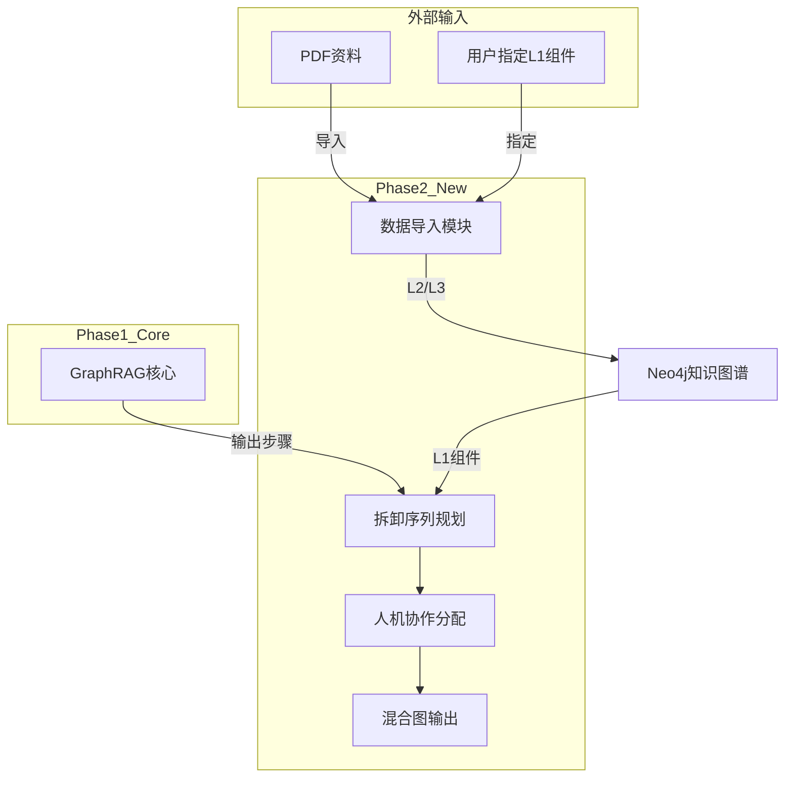

# 阶段2：混合图输出 + 拆卸序列规划 + 人机协作分配 设计文档

> **项目**：动力电池拆卸知识图谱与GraphRAG推理系统  
> **阶段**：Phase 2 - 混合图输出、拆卸序列规划、人机协作分配  
> **日期**：2026-04-14

---

## 1. 系统概述

**目标**：在阶段1核心KG+GraphRAG基础上，增加拆卸序列规划、人机协作分配、混合图输出功能。

**核心能力**：
- 拆卸序列规划（Tarjan环路检测 + 拓扑排序 + MTM时间估算）
- 人机协作分配（LLM实时9因素打分 + AS自动化得分）
- 混合图输出（Mermaid + JSON格式）
- 数据导入（PyMuPDF + LLM结构化）

---

## 2. 技术架构



---

## 3. 数据模型

### 3.1 三层知识图谱分层策略

| 层级 | 来源 | 管理方式 |
|------|------|----------|
| **L1: Component** | 仅用户指定（管理界面） | 需人工标记 |
| **L2: Document** | 所有PDF自动导入 | 自动沉淀 |
| **L3: Term** | 所有PDF自动提取 | 自动沉淀 |

**分层规则**：
- PDF导入时自动分配到 L2（Document）和 L3（Term）
- L1（Component）仅接受用户通过管理界面指定
- 避免自动分类导致的L1/L2混淆，确保拆卸序列规划质量

### 3.2 数据模型扩展

```python
from pydantic import BaseModel
from typing import Optional, Literal


class Component(BaseModel):
    id: str
    name: str
    battery_model: str
    tool_required: list[str] = []
    safety_level: int = 1
    preconditions: list[str] = []
    estimated_time: int = 0
    
    # 阶段2新增
    precedence: list[str] = []          # PRECEDES依赖
    time_estimate: int = 0              # MTM时间估算(秒)
    automation_score: float = 0.5       # AS自动化得分
    assignee: Optional[str] = None      # human/robot
    
    source_type: Literal['manual', 'auto'] = 'manual'
    metadata: dict = {}


class Document(BaseModel):
    doc_id: str
    title: str
    source: str                          # patent/standard/paper
    source_type: str
    content: str
    file_path: str                       # PDF文件路径
    metadata: dict = {}


class Term(BaseModel):
    term_id: str
    definition: str
    units: Optional[str] = None
    related_components: list[str] = []
```

---

## 4. 核心模块设计

### 4.1 数据导入模块 (Data Importer)

**功能**：将PDF资料导入知识图谱的L2/L3层

**流程**：
```
PDF文件 → 路径分类 → PyMuPDF提取 → LLM结构化 → 存入Neo4j
```

**路径分类规则**：
```python
def classify_source(file_path: str) -> dict:
    if any(x in file_path for x in ['专利', 'CN', 'WO']):
        return {'source': 'patent', 'target_layers': ['L2', 'L3']}
    elif any(x in file_path for x in ['国标', 'GBT']):
        return {'source': 'standard', 'target_layers': ['L2', 'L3']}
    elif '学术论文' in file_path:
        return {'source': 'paper', 'target_layers': ['L2', 'L3']}
```

**接口**：
```python
class DataImporter:
    def import_pdf(self, file_path: str) -> ImportResult:
        pass
    
    def promote_to_component(self, doc_id: str, component_data: dict):
        pass  # 用户通过管理界面指定L1
```

### 4.2 拆卸序列规划模块 (Sequence Planner)

**功能**：基于依赖关系生成拆卸序列

**算法流程**：
```
1. Tarjan算法检测环路
2. 环路拆分（如果有）
3. 拓扑排序生成序列
4. MTM方法计算时间
```

**MTM时间估算**（参考技术文档）：
```python
def calculate_time(component: Component) -> int:
    Ts = component.avg_operation_time    # 操作时间评分 0-3
    Tt = component.tool_switch_time      # 工具切换时间 0-3
    Tp = component.position_move_time    # 位置转移时间 0-3
    
    T_score = Ts + Tt + Tp
    T_seconds = (T_score / 5) * 85  # 得分转秒
    return int(T_seconds)
```

**接口**：
```python
class SequencePlanner:
    def plan(self, components: list[Component]) -> DisassemblySequence:
        pass
```

### 4.3 人机协作分配模块 (Human-Robot Allocator)

**功能**：基于AS得分分配human/robot

**LLM打分9因素**：
- 人力操作难度(H)：可视性、空间限制、物体移动要求、人因工程影响、重复性
- 拆卸安全(S)：高压风险、化学试剂风险、火灾爆炸风险、人身伤害风险

**AS计算**：
```python
def calculate_as(h_scores: list[float], s_scores: list[float], 
                 h_weights: list[float], s_weights: list[float]) -> float:
    h_sum = sum(h * w for h, w in zip(h_scores, h_weights))
    s_sum = sum(s * w for s, w in zip(s_scores, s_weights))
    return 0.5 * (h_sum + s_sum)
```

**分配规则**：
```python
if as_score > 0.6:
    assignee = 'robot'
elif as_score < 0.4:
    assignee = 'human'
else:
    # 成本比较
    assignee = 'robot' if robot_cost < human_cost else 'human'
```

**接口**：
```python
class HumanRobotAllocator:
    def allocate(self, sequence: DisassemblySequence) -> AllocationResult:
        pass
```

### 4.4 混合图输出模块 (Graph Output)

**功能**：生成Mermaid和JSON格式的拆卸图

**输出格式**：
```json
{
  'mermaid': 'graph TD\n  A[BatteryCover] --> B[Screws]\n  B --> C[Pack]',
  'json': {
    'nodes': [
      {'id': 'A', 'label': 'BatteryCover', 'assignee': 'human', 'time': 45},
      {'id': 'B', 'label': 'Screws', 'assignee': 'robot', 'time': 20}
    ],
    'edges': [
      {'from': 'A', 'to': 'B', 'type': 'PRECEDES'}
    ],
    'parallel_groups': [['A', 'C'], ['B']]
  }
}
```

**接口**：
```python
class GraphOutputGenerator:
    def generate(self, sequence: DisassemblySequence) -> GraphOutput:
        pass
```

---

## 5. API设计

### 5.1 新增端点

| 端点 | 方法 | 功能 |
|------|------|------|
| `/api/v1/disassembly/sequence` | POST | 拆卸序列规划 |
| `/api/v1/disassembly/allocate` | POST | 人机协作分配 |
| `/api/v1/disassembly/graph` | POST | 混合图输出 |
| `/api/v1/admin/import/pdf` | POST | 导入PDF数据 |
| `/api/v1/admin/import/status` | GET | 导入状态查询 |

### 5.2 管理界面（用户指定L1）

| 端点 | 方法 | 功能 |
|------|------|------|
| `/api/v1/admin/components` | GET | 列出所有L2文档 |
| `/api/v1/admin/components/{doc_id}/promote` | POST | 将L2文档升级为L1 |
| `/api/v1/admin/components` | GET | 列出所有L1组件 |

---

## 6. 文件结构（阶段2新增）

```
src/
├── importer/                    # 数据导入模块
│   ├── __init__.py
│   ├── pdf_parser.py           # PyMuPDF解析
│   ├── path_classifier.py      # 路径分类
│   ├── entity_extractor.py     # LLM提取L2/L3
│   └── importer.py             # 导入主逻辑
│
├── sequence/                    # 拆卸序列模块
│   ├── __init__.py
│   ├── planner.py              # 序列规划主逻辑
│   ├── cycle_detector.py       # Tarjan环路检测
│   ├── topological_sort.py     # 拓扑排序
│   └── time_estimator.py       # MTM时间估算
│
├── allocator/                   # 人机协作模块
│   ├── __init__.py
│   ├── scorer.py               # LLM 9因素打分
│   ├── as_calculator.py        # AS得分计算
│   └── allocator.py            # 分配主逻辑
│
├── graph_output/               # 混合图输出模块
│   ├── __init__.py
│   ├── mermaid_gen.py          # Mermaid生成
│   ├── json_builder.py         # JSON构建
│   └── generator.py            # 输出主逻辑
```

---

## 7. 实现顺序

1. **数据导入模块** - PDF解析 + LLM提取L2/L3 + 路径分类
2. **拆卸序列规划** - Tarjan + 拓扑排序 + MTM时间
3. **人机协作分配** - LLM打分 + AS计算
4. **混合图输出** - Mermaid + JSON
5. **管理界面** - 用户指定L1组件
6. **API整合** - 新增端点

---

## 8. 验收标准

- [ ] PDF导入自动分配到L2/L3
- [ ] 用户可通过管理界面指定L1 Component
- [ ] Tarjan算法正确检测环路
- [ ] 拓扑排序生成有效拆卸序列
- [ ] MTM时间估算符合技术文档公式
- [ ] LLM 9因素打分功能正常
- [ ] AS得分计算正确（>0.6 robot, <0.4 human）
- [ ] Mermaid图输出正确
- [ ] JSON图结构完整
- [ ] 并行组正确标记