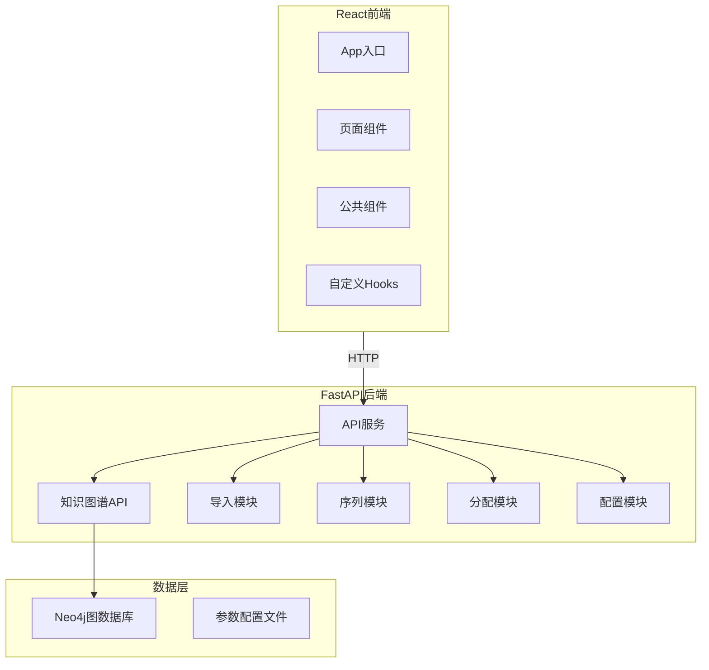

# 阶段3：可视化界面与参数管理 设计文档

> **项目**：动力电池拆卸知识图谱与GraphRAG推理系统  
> **阶段**：Phase 3 - 可视化界面、参数管理、文件导入  
> **日期**：2026-04-15

---

## 1. 系统概述

**目标：** 在Phase 1+2核心功能基础上，构建可视化前端界面，支持知识图谱查看、拆卸序列可视化、参数动态调整、文件导入管理。

**核心能力：**
- React前端 + Vite构建
- 知识图谱交互式可视化（含检索）
- 拆卸序列流程图 + 时间线视图
- LLM+KG推理反馈（推理过程+证据链+结果+置信度）
- 参数配置管理（9类参数）
- L1/L2/L3文件导入（CSV/TXT/PDF）
- Docker容器化部署

---

## 2. 技术架构



---

## 3. 前端架构

### 3.1 项目结构

```
frontend/
├── public/
│   └── favicon.ico
├── src/
│   ├── main.tsx
│   ├── App.tsx
│   ├── index.css
│   ├── api/
│   │   └── client.ts          # API客户端
│   ├── components/
│   │   ├── Layout/            # 布局组件
│   │   ├── GraphView/         # 图谱可视化
│   │   ├── SequenceView/      # 序列可视化
│   │   ├── FileImporter/      # 文件导入
│   │   ├── ParamEditor/       # 参数编辑
│   │   └── QueryPanel/       # 推理查询面板
│   ├── pages/
│   │   ├── Dashboard.tsx      # 仪表盘
│   │   ├── GraphExplorer.tsx  # 图谱浏览
│   │   ├── Query推理.tsx      # 推理查询
│   │   ├── SequencePlanner.tsx # 序列规划
│   │   ├── ImportManager.tsx  # 导入管理
│   │   └── Settings.tsx       # 参数设置
│   ├── hooks/
│   │   ├── useGraph.ts
│   │   ├── useSequence.ts
│   │   ├── useConfig.ts
│   │   └── useQuery.ts
│   ├── types/
│   │   └── index.ts
│   └── utils/
│       └── formatters.ts
├── index.html
├── package.json
├── tsconfig.json
├── vite.config.ts
└── Dockerfile
```

### 3.2 页面结构

| 页面 | 路径 | 功能 |
|------|------|------|
| 仪表盘 | `/` | 概览统计 + 最近10条推理记录（点击跳转推理页） |
| 图谱浏览 | `/graph` | 知识图谱交互 + 搜索 + 类型过滤 |
| 推理查询 | `/query` | 文本查询 + 模板选择 + 上下文多选 + Debug开关 + 推理过程 + 证据链 + 结果 + 导出 |
| 序列规划 | `/sequence` | 拆卸序列流程图 + 时间线视图 |
| 导入管理 | `/import` | L1/L2/L3导入（CSV/TXT/PDF） |
| 参数设置 | `/settings` | 参数配置 |

---

## 4. 核心功能设计

### 4.1 仪表盘

**功能：**
- 系统统计：节点数量、文档数量、术语数量
- 最近10条推理查询记录
- 快速入口按钮

**交互：**
- 点击记录跳转到推理查询页面，自动填充历史查询

### 4.2 图谱浏览

**技术选型：** react-force-graph-2d

**功能：**
- 节点类型着色（L1绿色、L2蓝色、L3橙色）
- 点击节点查看详情面板
- 展开/收起邻居节点
- 搜索框：按节点名称搜索
- 类型过滤：L1/L2/L3分类筛选
- 缩放平移交互

**API接口：**
```
GET /api/v1/graph/nodes - 获取所有节点
GET /api/v1/graph/node/{id} - 获取节点详情
GET /api/v1/graph/relationships - 获取关系
GET /api/v1/graph/search?q={query} - 搜索节点
```

### 4.3 推理查询

**功能：**
- **文本查询为主** - 用户输入自然语言问题
- **模板选择辅助** - 预设模板（如"拆卸XX型号电池"）
- **上下文多选** - 室温/低湿度/开阔空间/专业工具齐全
- **Debug开关** - 控制是否显示推理过程
- **实时进度时间线** - KG检索 → 证据构建 → LLM草稿 → 反馈循环
- **证据链展示** - 文字列表形式显示引用来源
- **生成结果** - 拆卸方案步骤列表
- **置信度信息** - 每步的置信度评分
- **导出按钮** - 导出拆卸方案

**API接口：**
```
POST /api/v1/disassembly/plan - 推理查询
GET /api/v1/query/history - 查询历史
```

### 4.4 拆卸序列可视化

**组件：**
- **流程图视图** - 使用react-flow展示依赖关系
- **时间线视图** - 横向时间轴展示拆卸步骤
- **详情面板** - 点击显示步骤详情、时间、工具、分配

**API接口：**
```
POST /api/v1/disassembly/sequence - 生成序列
GET /api/v1/disassembly/sequence/{battery_model} - 获取序列
```

### 4.5 文件导入管理

**L1组件导入：**

| 格式 | 说明 | 处理方式 |
|------|------|----------|
| 手动输入 | 单个组件快速添加 | 表单输入 |
| CSV | 批量结构化数据 | 解析CSV字段 |
| TXT | 模板文件 | 正则解析 |
| PDF | 手册文档 | PyMuPDF + LLM提取 |

**CSV格式：**
```csv
name,battery_model,tool_required,safety_level,precedence
电池盖,X123,"螺丝刀,扳手",2,"电池外壳,支架"
```

**TXT格式：**
```
[组件1]
名称: 电池盖
型号: X123
工具: 螺丝刀, 扳手
安全等级: 2
依赖: 电池外壳; 支架

[组件2]
...
```

**L2文档导入：**
- PDF文件上传 → PyMuPDF解析 → LLM实体提取 → 存入Neo4j L2层

**L3术语导入：**
- 自动从L2提取
- CSV/TXT批量导入

**API接口：**
```
POST /api/v1/import/l1/manual - L1手动导入
POST /api/v1/import/l1/csv - L1 CSV导入
POST /api/v1/import/l1/txt - L1 TXT导入
POST /api/v1/import/l1/pdf - L1 PDF提取
POST /api/v1/import/l2 - L2 PDF导入
POST /api/v1/import/l3 - L3导入
GET /api/v1/import/status - 导入状态
```

### 4.6 参数配置

| 分类 | 参数 | 类型 | 范围/默认值 |
|------|------|------|-------------|
| **MTM时间** | tool_switch_default | int | 5秒 |
| | position_default | int | 15秒 |
| | mtm_base_seconds | int | 85秒 |
| **AS评分** | h_weights | list[float] | [0.2,0.2,0.2,0.2,0.2] |
| | s_weights | list[float] | [0.25,0.25,0.25,0.25] |
| **分配阈值** | robot_threshold | float | 0.6 |
| | human_threshold | float | 0.4 |
| **成本决策** | cost_decision_enabled | bool | true |
| | robot_cost_default | float | 100.0 |
| | human_cost_default | float | 80.0 |
| | loss_cost_enabled | bool | true |
| **并行控制** | parallel_level | int | 0=不允许, 1=同层无依赖 |
| **时间系数** | time_mapping_coefficient | float | 1.0 |
| **LLM参数** | temperature | float | 0.1 |
| | max_tokens | int | 2000 |
| **RAG参数** | top_k | int | 30 |
| | similarity_threshold | float | 0.72 |
| | retrieval_depth | int | 2 |

**配置文件：** config.yaml

**API接口：**
```
GET /api/v1/config - 获取所有配置
PUT /api/v1/config/{category} - 更新分类配置
GET /api/v1/config/validate - 验证配置
```

---

## 5. 后端API扩展

### 5.1 新增路由

```python
# graph_routes.py
@router.get('/graph/nodes')
@router.get('/graph/node/{node_id}')
@router.get('/graph/relationships')
@router.get('/graph/search')

# query_routes.py
@router.post('/query/ask')
@router.get('/query/history')
@router.get('/query/history/{limit}')

# import_routes.py
@router.post('/import/l1/manual')
@router.post('/import/l1/csv')
@router.post('/import/l1/txt')
@router.post('/import/l1/pdf')
@router.post('/import/l2')
@router.post('/import/l3')
@router.get('/import/status')

# config_routes.py
@router.get('/config')
@router.put('/config/{category}')
@router.get('/config/validate')
@router.post('/config/reload')
```

---

## 6. 部署设计

### 6.1 Docker结构

```yaml
# docker-compose.yml
services:
  frontend:
    build: ./frontend
    ports:
      - "3000:3000"
    depends_on:
      - backend

  backend:
    build: ./backend
    ports:
      - "8000:8000"
    volumes:
      - ./config.yaml:/app/config.yaml
    depends_on:
      - neo4j

  neo4j:
    image: neo4j:5.20
    ports:
      - "7474:7474"
      - "7687:7687"
    volumes:
      - neo4j_data:/data
```

---

## 7. 实现顺序

1. **前端项目初始化** - Vite + React + TypeScript + 依赖安装
2. **基础组件** - 布局、导航、API客户端
3. **后端API扩展** - 图谱/查询/导入/配置路由
4. **图谱可视化** - react-force-graph集成
5. **推理查询** - 查询面板 + 进度时间线 + 证据展示
6. **拆卸序列可视化** - react-flow流程图
7. **文件导入** - L1/L2/L3导入页面
8. **参数配置** - 设置页面 + 配置管理
9. **Docker配置** - 容器化部署

---

## 8. 验收标准

- [ ] React前端正常运行
- [ ] 图谱可视化交互正常（含检索过滤）
- [ ] 推理查询功能完整（文本+模板+上下文+Debug+证据+导出）
- [ ] 序列流程图展示正确
- [ ] L1/L2/L3导入功能正常（CSV/TXT/PDF）
- [ ] 参数配置保存生效
- [ ] Docker容器部署成功

---

## 9. 依赖清单

**前端：**
- react, react-dom (18.x)
- react-router-dom (6.x)
- react-force-graph-2d
- reactflow
- axios
- @tanstack/react-query

**后端：**
- pyyaml
- python-multipart