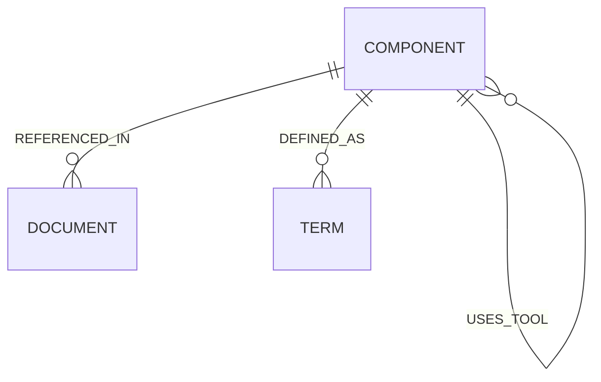
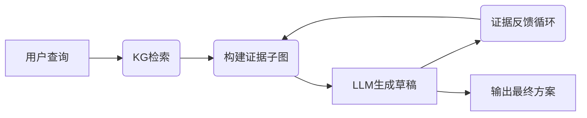

```markdown
# 动力电池拆卸知识图谱与GraphRAG推理模块设计 - AI编程专用技术文档

## 系统约束与技术选型

- **知识图谱规模**：节点数万级（目标 ≤ 15,000 节点，关系 ≤ 80,000）。
- **性能指标**：
  - 端到端响应时间（P95）：≤ 800ms（调试模式允许 ≤ 2000ms）
  - KG子图检索 + 证据构建：≤ 150ms
  - 单次LLM调用：≤ 500ms
  - 支持并发：≥ 20 QPS（单实例）
- **LLM模型**：
  - 首选：GPT-4o / GPT-4-turbo（OpenAI API）
  - 开源备选：Qwen2.5-72B、DeepSeek-R1-70B、Llama-3.3-70B（vLLM部署）
  - 要求：支持JSON模式，上下文窗口 ≥ 32K tokens
- **知识源**：基于133条资料（14项国家标准、39项专利、80篇论文），已整理为结构化JSON + Markdown。
- **硬件环境**：Windows 11 + NVIDIA RTX 4070（开发机）；推荐部署使用Linux服务器（16核CPU + GPU）。
- **部署方式**：全容器化（Docker + Docker Compose）。
- **开发栈**：
  - Python 3.11+
  - FastAPI + Uvicorn
  - Neo4j 5.20+
  - Milvus 2.4+
  - LangChain（可选）
  - Streamlit（可视化界面）
  - 依赖管理：Poetry 或 requirements.txt

## 系统架构

```mermaid
flowchart TB
    subgraph 客户端
        UI[用户应用 / Streamlit]
    end
    subgraph 系统核心
        UI -->|请求| APISvc[API 服务 (FastAPI)]
        APISvc --> Auth[认证/授权]
        APISvc --> KGsvc[KG 服务 (Neo4j + Milvus)]
        APISvc --> InferSvc[推理服务 (GraphRAG)]
        InferSvc --> LLM[LLM 模型]
        KGsvc -->|查询/扩展| InferSvc
        Auth --> Logs[监控日志]
    end
```

## 三层知识图谱数据模型

- **L1: Component**（拆卸部件/步骤）  
  属性：`id, name, battery_model, tool_required`
- **L2: Document**（参考文档）  
  属性：`doc_id, title, source, content`
- **L3: Term**（术语定义）  
  属性：`term_id, definition, units`

**关系（Neo4j）**：
- `(Component)-[:REFERENCED_IN]->(Document)`
- `(Component)-[:DEFINED_AS]->(Term)`
- `(Component)-[:PRECEDES]->(Component)`（拆卸顺序）
- `(Component)-[:USES_TOOL]->(Component)`



**必须创建的索引**：
```cypher
CREATE INDEX FOR (n:Component) ON (n.id);
CREATE INDEX FOR (n:Document) ON (n.doc_id);
CREATE INDEX FOR (n:Term) ON (n.term_id);
```

## GraphRAG 推理流程



```pseudocode
function GraphRAG(query, debug=False):
    seedNodes = KG.search(query, topK=30)
    evidence = KG.expand(seedNodes, depth=2)
    draft = LLM.generate(query, context=evidence.to_text())
    final = feedbackLoop(draft, evidence)
    if debug:
        return {"steps": final.steps, "trace": evidence.trace}
    return final

function feedbackLoop(answer, evidence):
    for step in answer.steps:
        if not validate_evidence(step, evidence):
            missing = extract_missing_terms(step)
            newNodes = KG.search(missing, topK=10)
            evidence.expand(newNodes)
            answer = LLM.regenerate(query, context=evidence.to_text())
    return answer
```

**参数建议**：
- `topK`: 30~80
- `depth`: 2
- 相似度阈值: 0.72
- LLM超时: 8秒

## 核心算法

### Tarjan 环路检测
```pseudocode
function detectCycles(graph):
    index = 0
    stack = []
    for v in graph.vertices:
        if not hasattr(v, 'index'):
            strongConnect(v)

function strongConnect(v):
    global index
    v.index = index
    v.lowlink = index
    index += 1
    stack.append(v)
    v.onStack = True
    for w in v.neighbors:
        if not hasattr(w, 'index'):
            strongConnect(w)
            v.lowlink = min(v.lowlink, w.lowlink)
        elif w.onStack:
            v.lowlink = min(v.lowlink, w.index)
    if v.lowlink == v.index:
        comp = []
        while True:
            u = stack.pop()
            u.onStack = False
            comp.append(u)
            if u == v: break
        processCycle(comp)
```

### Tarjan Python 实现（可直接使用）
```python
idx = 0
stack = []

def strongConnect(v):
    global idx
    v.index = idx
    v.lowlink = idx
    idx += 1
    stack.append(v)
    v.onStack = True
    for w in v.neighbors:
        if not hasattr(w, 'index'):
            strongConnect(w)
            v.lowlink = min(v.lowlink, w.lowlink)
        elif w.onStack:
            v.lowlink = min(v.lowlink, w.index)
    if v.lowlink == v.index:
        comp = []
        while True:
            u = stack.pop()
            u.onStack = False
            comp.append(u)
            if u == v:
                break
        processCycle(comp)
```

## 接口规范

### REST 接口
**POST** `/api/v1/disassembly/plan`

**请求体**：
```json
{
  "battery_model": "X123",
  "context": ["室温环境", "低湿度"],
  "debug": false
}
```

**成功响应**：
```json
{
  "code": 0,
  "steps": [
    {
      "id": 1,
      "component": "BatteryCover",
      "action": "remove screws",
      "evidence": ["manual_section_2.1"]
    }
  ],
  "message": "Success"
}
```

**调试模式响应**（debug=true）：额外返回 `trace` 字段，包含KG检索记录、证据子图、LLM输入输出、反馈迭代次数。

### gRPC 接口（proto）
```protobuf
service Planner {
  rpc Execute(PlanRequest) returns (PlanResponse);
}

message PlanRequest {
  string battery_model = 1;
  repeated string context = 2;
  bool debug = 3;
}

message Step {
  int32 id = 1;
  string component = 2;
  string action = 3;
  repeated string evidence = 4;
}

message PlanResponse {
  repeated Step steps = 1;
  int32 code = 2;
  string message = 3;
  optional Trace trace = 4;   // debug模式返回
}
```

## 可视化界面规范（Streamlit）

**页面结构**：
1. **查询页**：电池型号 + 上下文多选 + Debug开关 + 生成按钮
2. **实时推理页**（Debug模式）：
   - 进度时间线：KG检索 → 证据构建 → LLM草稿 → 反馈循环（迭代显示）
   - 右侧实时日志 + Mermaid子图
   - 支持“手动补充检索”“重新生成当前步骤”
3. **结果页**：步骤列表 + 置信度 + 整体拆卸顺序Mermaid图 + 导出按钮
4. **KG可视化页**：交互式子图浏览器（streamlit-agraph）

**交互要求**：
- 实时进度更新（st.empty / st.progress）
- 点击证据可跳转文档内容
- 支持暂停/继续反馈循环

## 附录

### 环境变量（.env）
```bash
NEO4J_URI=bolt://localhost:7687
NEO4J_USER=neo4j
NEO4J_PASSWORD=password
MILVUS_HOST=localhost
MILVUS_PORT=19530
LLM_API_KEY=sk-...
OPENAI_BASE_URL=...
```

**文档使用说明（仅供AI编程参考）**：  
本文档所有代码块、Mermaid图、伪代码、接口定义、可视化规范均可直接复制使用。AI可按以下顺序生成代码：

1. Neo4j数据模型 + 索引 + 导入脚本
2. GraphRAG核心模块（含feedbackLoop）
3. FastAPI接口实现
4. Streamlit可视化界面（支持debug trace）
5. Docker Compose完整配置

```